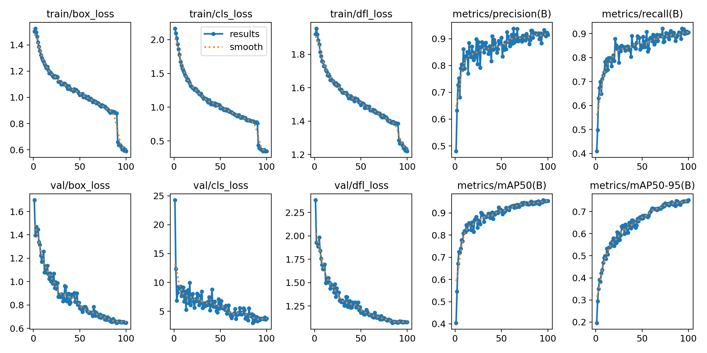
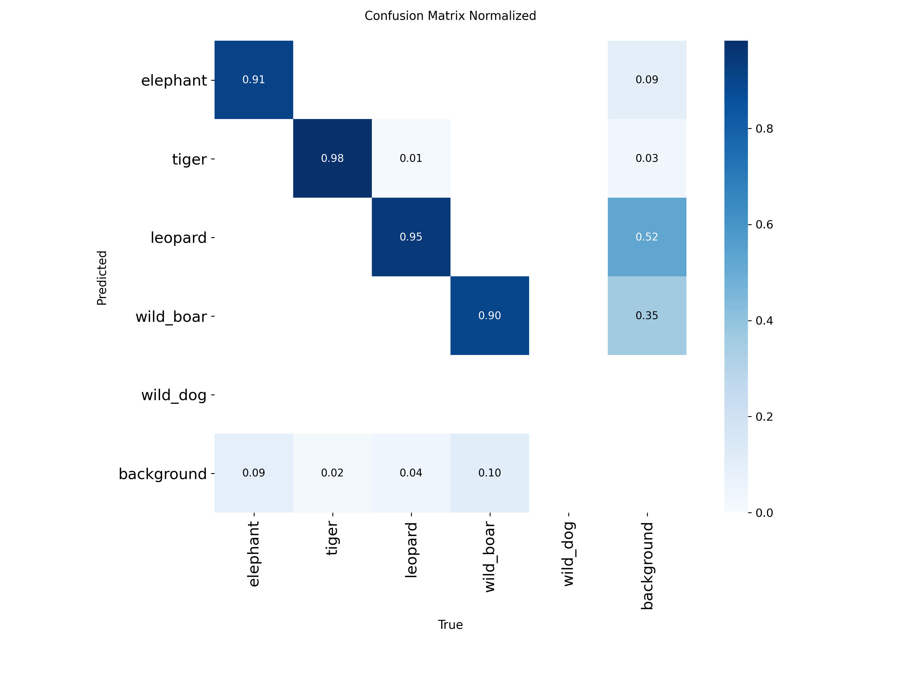
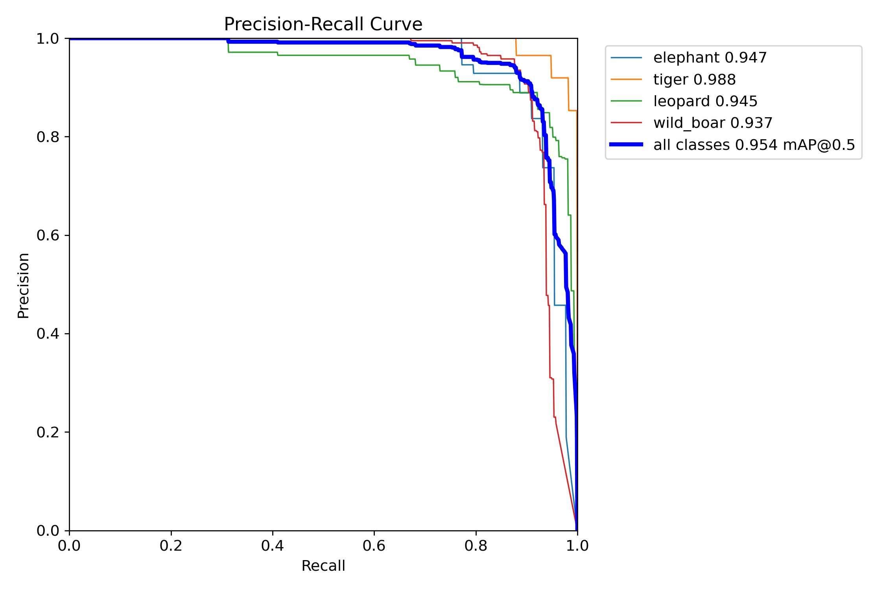

# 🦁 EcoSentinel — Real-Time Wildlife Intrusion Detection

[](https://python.org)
[](https://ultralytics.com)
[](LICENSE)
[]()
[]()

> **Real-time detection of dangerous wildlife species to prevent human-wildlife conflict using deep learning.**

EcoSentinel is an AI-powered wildlife intrusion detection system that automatically identifies dangerous animals from live camera feeds and triggers alerts — enabling proactive community protection before conflict occurs.

---

## 🎯 Detected Species

| Class | AP@50 | Training Samples |
|-------|-------|-----------------|
| 🐘 Elephant | 82.69% | 528 |
| 🐯 Tiger | 94.77% | 1,034 |
| 🐆 Leopard | 95.41% | 718 |
| 🐗 Wild Boar | 96.44% | 1,872 |

---

## 📊 Model Performance

| Metric | Score |
|--------|-------|
| **mAP@50** | **0.9233** |
| mAP@50:95 | 0.6816 |
| Precision | 0.9065 |
| Recall | 0.8776 |
| Inference Speed | 50.5ms / image (~20 FPS) |
| Model Size | 52 MB |

---

## 🏗️ System Architecture

```
Raw Datasets (5 sources, heterogeneous)
         ↓
Dataset Fusion Pipeline (ecosentinel_pipeline.py)
  ├── Class remapping & filtering
  ├── Split normalization (80/10/10)
  └── Hard negative mining
         ↓
Unified Dataset (3,983 images, 4 classes)
         ↓
YOLOv8s Fine-tuning (train_ecosentinel.py)
  ├── Transfer learning from COCO weights
  ├── Inverse-frequency class weighting
  └── Mosaic + Copy-paste augmentation
         ↓
Real-Time Inference (inference.py)
  ├── Live camera / video / image support
  ├── Per-class confidence thresholds
  ├── Auto alert snapshot saving
  └── Timestamped detection logging
```

---

## 🚀 Quick Start

### 1. Clone & Setup

```bash
git clone https://github.com/RUPANARAYANAN-R/EcoSentinel.git
cd EcoSentinel

# Create virtual environment
python -m venv .venv

# Windows
.venv\Scripts\Activate.ps1

# Install dependencies
pip install torch torchvision torchaudio --index-url https://download.pytorch.org/whl/cu121
pip install ultralytics opencv-python pyyaml albumentations
```

### 2. Download Datasets

Download the following annotated datasets from Roboflow Universe and place them in the project root:

| Dataset | Roboflow Link | Species |
|---------|--------------|---------|
| Leopard v1 | [Link](https://universe.roboflow.com/animals/leopard-5jady) | Leopard |
| Tegers New v1 | [Link](https://universe.roboflow.com/s-workspace-tqqcb/tegers_new) | Tiger |
| Wild Boar Test 2 | [Link](https://universe.roboflow.com/babel/wild-boar-test-2) | Wild Boar |
| WildAnimalIntrusion v3 | [Link](https://universe.roboflow.com/dhruv2003s-workspace/wildanimalintrusioninurbanareas2) | Leopard + Tiger |
| Wildlife Detection v3 | [Link](https://universe.roboflow.com/home-yimsz/wildlife-detection-xzfay) | Elephant + Boar + Leopard + Tiger |
| Elephants v4 | [Link](https://universe.roboflow.com/ultimateele03/elephants-wz5qt) | Elephant |

### 3. Build Unified Dataset

```bash
python ecosentinel_pipeline.py
```

Expected output:
```
TOTAL IMAGES : 3983
elephant  🟠 MODERATE (528)
leopard   🟠 MODERATE (718)
tiger     🟢 GOOD (1034)
wild_boar 🟢 GOOD (1872)
```

### 4. Add Hard Negatives

```bash
python add_negatives.py
```

### 5. Train

```bash
python train_ecosentinel.py
```

Training configuration (edit `train_ecosentinel.py`):

```python
MODEL  = "yolov8s.pt"   # backbone
EPOCHS = 100
BATCH  = 8              # for 4GB VRAM
DEVICE = 0              # GPU
```

### 6. Run Real-Time Detection

```bash
# Webcam
python inference.py --source 0

# Video file
python inference.py --source path/to/video.mp4

# Image
python inference.py --source path/to/image.jpg

# Save output video
python inference.py --source 0 --save-video

# Custom confidence threshold
python inference.py --source 0 --conf 0.35
```

---

## 📁 Project Structure

```
EcoSentinel/
├── ecosentinel_pipeline.py    # Dataset fusion pipeline
├── train_ecosentinel.py       # YOLOv8 training script
├── inference.py               # Real-time detection
├── add_negatives.py           # Hard negative mining
├── compare_models.py          # Benchmark vs other models
├── requirements.txt           # Dependencies
├── assets/                    # Figures for paper & README
│   ├── confusion_matrix.png
│   ├── pr_curve.png
│   ├── f1_curve.png
│   ├── results.png
│   └── detection_samples.jpg
├── unified_dataset/           # Generated by pipeline (not tracked)
│   ├── train/
│   ├── val/
│   ├── test/
│   └── data.yaml
└── runs/                      # Training outputs (not tracked)
    └── ecosentinel_v1/
        └── weights/
            └── best.pt
```

---

## 📈 Training Results

### Training Curves


### Confusion Matrix


### Precision-Recall Curve


---

## 🔧 Dataset Pipeline — Key Innovation

The EcoSentinel dataset pipeline solves the **heterogeneous wildlife dataset problem**:

```python
# Each dataset uses different class names — handled automatically
DATASET_CONFIGS = [
    {
        "name": "wild_boar_dataset",
        "remap": {
            "pig": "wild_boar",  # auto-rename ✅
        }
    },
    {
        "name": "intrusion_dataset",
        "remap": {
            "leopard": "leopard",   # keep ✅
            "tiger": "tiger",       # keep ✅
            # cheetah, jaguar, lion → automatically discarded ❌
        }
    },
]
```

Features:
- **Auto class remapping** — handles naming inconsistencies across datasets
- **Split normalization** — redistributes train-only datasets into 80/10/10
- **Hard negative mining** — extracts confuser images as background samples
- **Class health check** — reports data sufficiency per class before training

---

## ⚙️ Requirements

```
Python       >= 3.12
PyTorch      >= 2.0 (CUDA 12.1 recommended)
Ultralytics  >= 8.0
OpenCV       >= 4.8
GPU VRAM     >= 4GB (RTX 2050 or better)
Disk Space   >= 10GB
```

---

## 📄 Citation

If you use EcoSentinel in your research, please cite:

```bibtex
@inproceedings{rupanarayanan2026ecosentinel,
  title     = {EcoSentinel: Real-Time Multi-Class Wildlife Intrusion Detection
               Using YOLOv8 for Human-Wildlife Conflict Mitigation},
  author    = {Rupanarayanan, R. and Mohamed Idrees, S. and Pradeesh, M.
               and Roshan, D. and Manikandan, R.},
  booktitle = {Proceedings of the International Conference on Advanced
               Technologies for Disaster Management (ICATDM)},
  year      = {2026},
  address   = {Hyderabad, India}
}
```

---

## 👥 Authors

| Name | Role | Institution |
|------|------|-------------|
| Rupanarayanan R | Lead Developer | Nandha Engineering College, Erode |
| Mohamed Idrees S | Dataset Pipeline | Nandha Engineering College, Erode |
| Pradeesh M | Model Training | Nandha Engineering College, Erode |
| Roshan D | Inference System | Nandha Engineering College, Erode |
| Mr. R. Manikandan, M.Tech. | Project Mentor | Nandha Engineering College, Erode |
| Dr. T. Rajasekaran, Prof. & Head / CSE | Project Mentor | Nandha Engineering College, Erode |

---

## 📜 License

This project is licensed under the MIT License — see [LICENSE](LICENSE) for details.

Dataset licenses vary per source — refer to individual Roboflow dataset pages for terms.

---

## 🤝 Acknowledgments

- [Ultralytics](https://ultralytics.com) for the YOLOv8 framework
- [Roboflow Universe](https://universe.roboflow.com) dataset contributors
- Department of CSE, Nandha Engineering College, Erode for infrastructure support

---

*EcoSentinel — Protecting communities. Preserving wildlife.*
